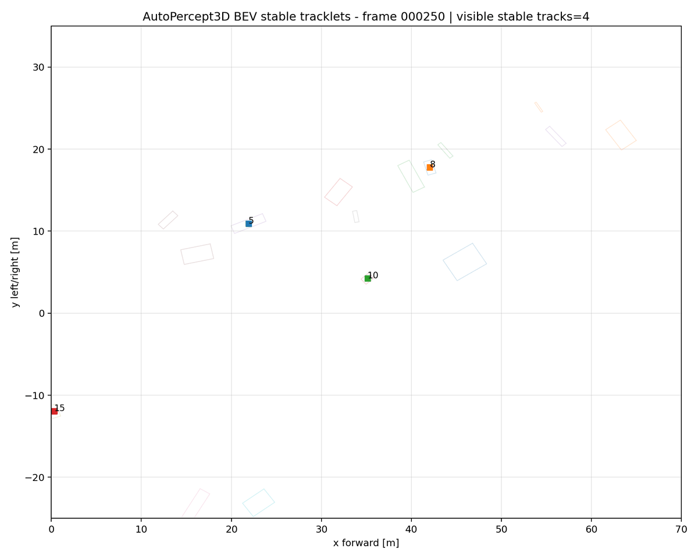
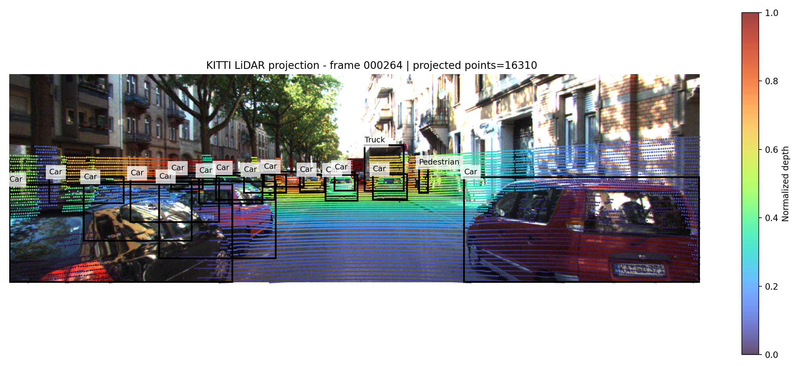
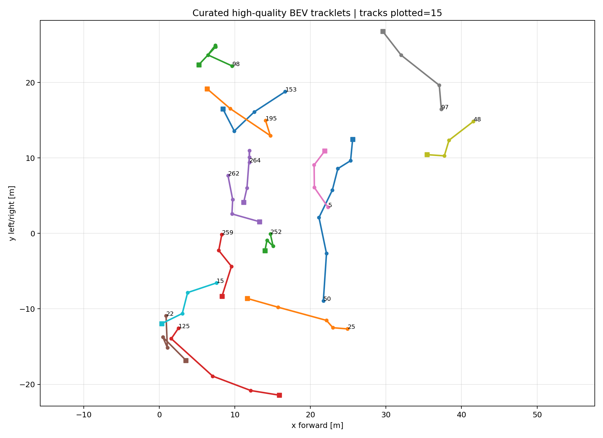

# AutoPercept3D

**AutoPercept3D** is a KITTI-first autonomous-driving LiDAR perception, visualization, evaluation, and tracklet-analysis workbench.

It builds an explainable classical perception pipeline for autonomous-driving scenes:

```text
KITTI LiDAR + camera + calibration
        ↓
ROI crop + voxel downsampling
        ↓
RANSAC ground removal
        ↓
DBSCAN object clustering
        ↓
axis-aligned + PCA-oriented 3D proposal boxes
        ↓
BEV/camera visualization + IoU evaluation + stable tracklet review
```

> This project is a classical LiDAR perception workbench, not a deep-learning detector and not official KITTI benchmark evaluation.

---

## Demo Preview

### Stable BEV Tracklet Replay



### Camera + LiDAR Projection



### BEV Object Proposal View


### Camera 3D Box Overlay


### Curated High-Quality Tracklets



---

## Highlights

- Loads KITTI Object Detection camera images, Velodyne point clouds, calibration files, and labels.
- Runs a modular LiDAR pipeline with ROI cropping, voxel downsampling, RANSAC ground removal, DBSCAN clustering, and 3D proposal generation.
- Generates both axis-aligned and PCA-oriented 3D proposal boxes.
- Visualizes results in BEV and camera space, including LiDAR projection, projected 3D boxes, and KITTI ground-truth overlays.
- Provides Streamlit dashboards for frame-level perception debugging and tracklet review.
- Evaluates proposals using a lightweight BEV IoU metric against KITTI labels.
- Mines stable BEV tracklets over frame ranges, exports replay frames, curates high-quality tracklets, and creates GIF/contact-sheet demo assets.
- Includes a one-command showcase exporter for reproducible demo generation.

---

## Dataset

This project uses the **KITTI Object Detection** dataset.

Expected dataset layout:

```text
kitti_object/
    training/
        image_2/
        velodyne/
        calib/
        label_2/
    testing/
        image_2/
        velodyne/
        calib/
```

The dataset is not included in this repository.

---

## Setup

```bat
cd <PATH_TO_AUTOPERCEPT3D>
python -m venv .venv
.venv\Scripts\activate.bat
python -m pip install --upgrade pip
pip install -e .
pip install -r requirements.txt
```

Set your KITTI path:

```bat
set KITTI_ROOT=<PATH_TO_KITTI_OBJECT_DATASET>
```

---

## Quick Start

Run the single-frame pipeline:

```bat
python scripts\run_frame_pipeline.py --dataset-root "%KITTI_ROOT%" --frame 000264 --output-dir outputs
```

Run the main perception dashboard:

```bat
streamlit run scripts\dashboard_app.py
```

Run the tracklet review dashboard:

```bat
streamlit run scripts\dashboard_tracklets_app.py
```

Generate the full showcase package:

```bat
python scripts\export_showcase_package.py --dataset-root "%KITTI_ROOT%" --frame 000264 --start-index 250 --max-frames 20 --output-dir showcase_export_250_269
```

---

## Example Results

### Single Frame: `000264`

```text
Raw LiDAR points:       101481
Downsampled points:      10055
Non-ground points:        6444
Proposal boxes:             34
Approx FPS:               ~9
```

Lightweight BEV IoU evaluation:

```text
Proposals:       34
Ground truth:    17
Matches:         13
Precision:     0.382
Recall:        0.765
Mean IoU:      0.441
```

### Batch Range: `000250–000269`

```text
Frames OK:       20 / 20
Avg precision:   0.122
Avg recall:      0.645
Avg mean IoU:    0.488
Avg proposals:  34.30
```

### Stable Tracklet Mining

```text
Stable tracklets:        68
Stable records:         247
Mean track length:     3.63
Max track length:         7
Mean track score:     0.695
```

### High-Quality Tracklet Curation

```text
Input stable tracklets:   68
Curated tracklets:        15
Curated records:          67
Curated ratio:         0.221
Curated mean score:    0.777
Curated mean points:  123.91
```

---

## Main Workflows

### 1. Export Demo Assets

```bat
python scripts\export_demo_assets.py --dataset-root "%KITTI_ROOT%" --frame 000264 --output-dir demo_assets
```

### 2. Evaluate One Frame

```bat
python scripts\evaluate_frame_iou.py --dataset-root "%KITTI_ROOT%" --frame 000264 --iou-threshold 0.10 --output-json reports\eval_000264.json --save-plot reports\eval_000264.png
```

### 3. Batch IoU Evaluation

```bat
python scripts\run_batch_iou_evaluation.py --dataset-root "%KITTI_ROOT%" --start-index 250 --max-frames 20 --iou-threshold 0.10 --output-dir reports_iou_250_269
```

### 4. Stable Tracklet Replay

```bat
python scripts\render_tracklet_replay.py --dataset-root "%KITTI_ROOT%" --start-index 250 --max-frames 20 --box-type oriented --output-dir tracklet_replay_250_269
```

### 5. Tracklet Analytics

```bat
python scripts\analyze_tracklets.py --tracklets-csv tracklet_replay_250_269\stable_tracklets.csv --output-dir tracklet_analysis_250_269
```

### 6. High-Quality Tracklet Curation

```bat
python scripts\curate_tracklets.py --tracklets-csv tracklet_replay_250_269\stable_tracklets.csv --output-dir tracklet_curation_250_269
```

### 7. Tracklet GIF Export

```bat
python scripts\export_tracklet_gif.py --frames-dir tracklet_replay_250_269\frames --output-dir tracklet_demo_export_250_269 --duration-ms 700
```

More commands are listed in [`docs/COMMANDS.md`](docs/COMMANDS.md).

---

## Dashboards

### Perception Dashboard

```bat
streamlit run scripts\dashboard_app.py
```

Features:

- frame selection
- configurable preprocessing, ground removal, and clustering parameters
- camera image view
- BEV perception view
- axis-aligned vs PCA-oriented box comparison
- runtime metrics
- BEV IoU evaluation panel

### Tracklet Review Dashboard

```bat
streamlit run scripts\dashboard_tracklets_app.py
```

Features:

- stable vs curated tracklet inspection
- frame-by-frame BEV track history
- active track table
- curation analytics
- replay frame viewer

---

## One-Command Showcase Export

The showcase exporter regenerates the main demo outputs in a single command:

```bat
python scripts\export_showcase_package.py --dataset-root "%KITTI_ROOT%" --frame 000264 --start-index 250 --max-frames 20 --output-dir showcase_export_250_269
```

It creates:

```text
showcase_export_250_269/
    SHOWCASE_SUMMARY.md
    showcase_manifest.json
    frame_demo/
    frame_eval/
    batch_iou/
    tracklet_replay/
    tracklet_curation/
    tracklet_demo/
```

Generated folders are ignored by Git by default.

---

## Current Limitations

- The perception pipeline is classical and proposal-based; it does not classify object categories.
- DBSCAN can still over-segment or merge nearby objects.
- BEV IoU is a lightweight AABB-style proposal metric, not official KITTI evaluation.
- Tracklets are mined from object proposals and are intended for qualitative temporal inspection, not official multi-object tracking benchmarking.
- No learned 3D detector, semantic segmentation, or official KITTI tracking benchmark integration is included yet.

---

## Skills Demonstrated

- LiDAR point-cloud processing
- camera/LiDAR calibration handling
- KITTI data loading and coordinate transforms
- classical 3D object proposal generation
- PCA-oriented BEV box estimation
- BEV and camera-space visualization
- proposal-level IoU evaluation
- stable tracklet mining and curation
- Streamlit dashboard development
- reproducible demo/export tooling
