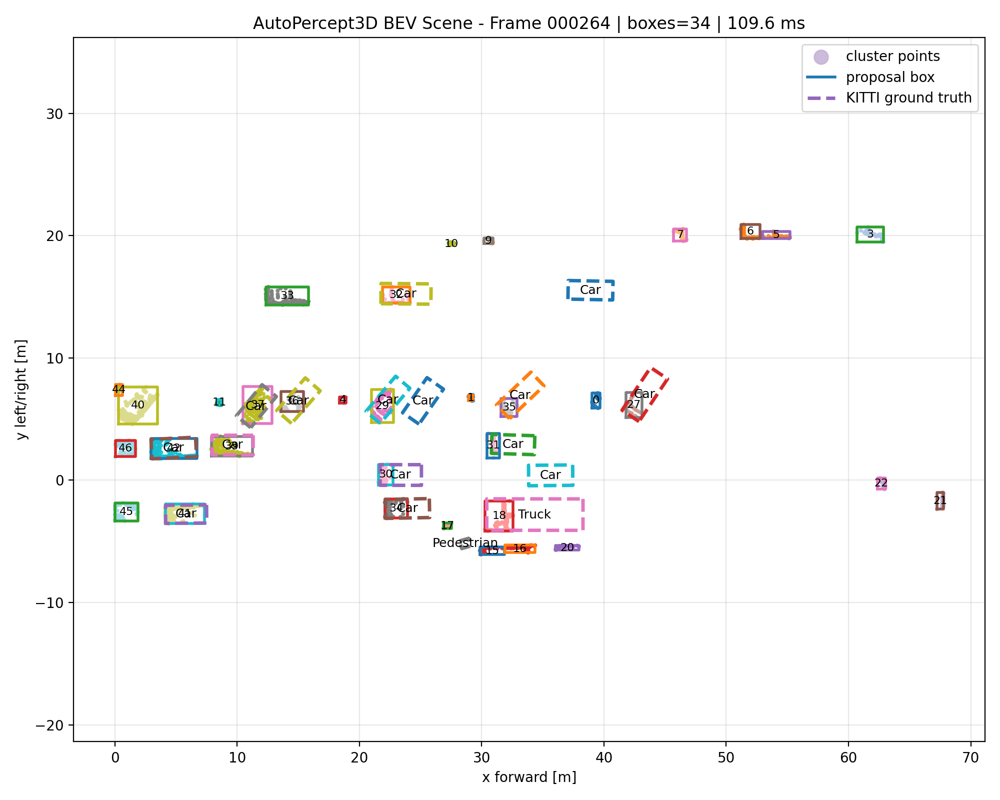
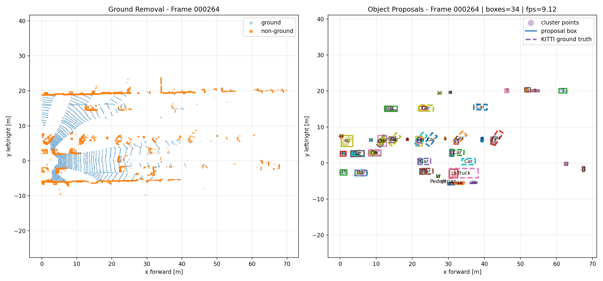
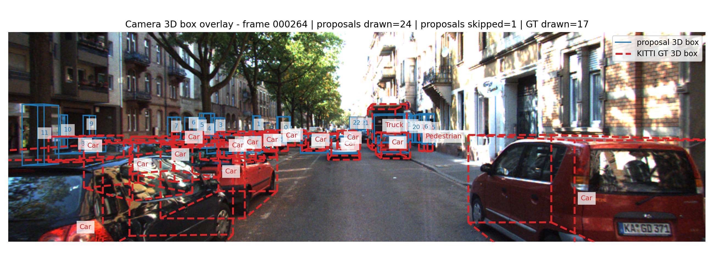

# AutoPercept3D

**AutoPercept3D** is a KITTI-first autonomous-driving LiDAR perception and visualization workbench.

It implements a complete classical LiDAR perception MVP for autonomous-driving scenes:

```text
KITTI Object Detection dataset
    ↓
LiDAR + camera + calibration + labels
    ↓
ROI crop + voxel downsampling
    ↓
RANSAC ground removal
    ↓
DBSCAN non-ground clustering
    ↓
3D object proposal boxes
    ↓
BEV visualization + camera projection + evaluation dashboard
```

This is a working **v1 portfolio project**. The current system is a classical perception baseline, not a deep-learning detector.

---

## Demo Preview

### Camera + LiDAR Projection


### BEV Object Proposal View



### Ground Removal + Proposal Summary



### Camera 3D Box Overlay



---

## Current MVP Features

- KITTI Object Detection dataset loader
- camera image loading
- Velodyne LiDAR point-cloud loading
- calibration parsing
- KITTI label parsing
- LiDAR ROI cropping
- voxel-grid downsampling
- RANSAC ground-plane removal
- DBSCAN clustering on non-ground points
- axis-aligned 3D object proposal boxes
- BEV proposal visualization
- KITTI ground-truth BEV overlay
- LiDAR-to-camera projection
- 3D box projection onto camera image
- single-frame pipeline runner
- multi-frame batch pipeline runner
- demo asset exporter
- Streamlit dashboard
- lightweight BEV IoU proposal evaluation
- batch IoU evaluation reports

---

## Important Project Positioning

The current detector output should be described as:

```text
classical LiDAR cluster-based 3D object proposals
```

The project currently does **not** perform object classification. It proposes object-like 3D regions from LiDAR clusters and compares them against KITTI labels using a lightweight BEV IoU metric.

This is not official KITTI benchmark evaluation.

---

## Dataset

This project currently uses the **KITTI Object Detection** dataset.

Expected local dataset root:

```text
C:\Users\KISHORE KHAN\Desktop\Projects\datasets\kitti_object
```

Expected folder structure:

```text
kitti_object/
    training/
        image_2/
        velodyne/
        calib/
        label_2/
    testing/
        image_2/
        velodyne/
        calib/
```

The dataset is not included in this repository.

---

## Project Architecture

```text
autopercept3d/
    README.md
    requirements.txt
    .gitignore
    pyproject.toml

    scripts/
        dashboard_app.py
        export_demo_assets.py
        run_frame_pipeline.py
        run_batch_pipeline.py
        evaluate_frame_iou.py
        run_batch_iou_evaluation.py
        render_bev_scene.py
        render_frame_summary.py
        render_lidar_projection.py
        render_camera_3d_boxes.py
        inspect_kitti_frame.py
        inspect_preprocessing.py
        inspect_ground_removal.py
        inspect_clustering.py
        inspect_bounding_boxes.py
        inspect_ground_truth_overlay.py

    src/
        autopercept3d/
            datasets/
                kitti.py

            perception/
                preprocessing.py
                ground_removal.py
                clustering.py
                bounding_boxes.py
                pipeline.py

            geometry/
                kitti_transforms.py
                projection.py

            visualization/
                bev.py
                camera.py
                projection.py
                camera_boxes.py

            evaluation/
                batch.py
                matching.py
                batch_iou.py
```

### Module Responsibilities

| Module | Responsibility |
|---|---|
| `datasets/` | Load KITTI images, LiDAR, labels, and calibration files |
| `perception/` | Core LiDAR processing pipeline |
| `geometry/` | KITTI coordinate transforms and camera projection |
| `visualization/` | BEV, camera, projection, and 3D-box visualizations |
| `evaluation/` | Batch metrics and lightweight BEV IoU proposal evaluation |
| `scripts/` | User-facing commands and dashboard entry points |

---

## Setup on Windows CMD

From the project folder:

```bat
cd "C:\Users\KISHORE KHAN\Desktop\Projects\autopercept3d"
```

Create and activate a virtual environment:

```bat
python -m venv .venv
.venv\Scripts\activate.bat
```

Upgrade pip:

```bat
python -m pip install --upgrade pip
```

Install the project and dependencies:

```bat
pip install -e .
pip install -r requirements.txt
```

---

## Quick Start

Run the full pipeline on one frame:

```bat
python scripts\run_frame_pipeline.py --dataset-root "C:\Users\KISHORE KHAN\Desktop\Projects\datasets\kitti_object" --frame 000264 --output-dir outputs
```

Run the dashboard:

```bat
python -m streamlit run scripts\dashboard_app.py
```

Then select frame `000264` and click **Run pipeline**.

---

## Main Commands

### Inspect One KITTI Frame

```bat
python scripts\inspect_kitti_frame.py --dataset-root "C:\Users\KISHORE KHAN\Desktop\Projects\datasets\kitti_object" --frame 000000
```

### Preprocessing Inspection

```bat
python scripts\inspect_preprocessing.py --dataset-root "C:\Users\KISHORE KHAN\Desktop\Projects\datasets\kitti_object" --frame 000000 --voxel-size 0.2 --save assets\preprocessing_000000.png
```

### Ground Removal

```bat
python scripts\inspect_ground_removal.py --dataset-root "C:\Users\KISHORE KHAN\Desktop\Projects\datasets\kitti_object" --frame 000000 --voxel-size 0.2 --distance-threshold 0.25 --save assets\ground_removal_000000.png
```

### Clustering

```bat
python scripts\inspect_clustering.py --dataset-root "C:\Users\KISHORE KHAN\Desktop\Projects\datasets\kitti_object" --frame 000000 --voxel-size 0.2 --ground-threshold 0.25 --eps 0.8 --min-samples 10 --save assets\clustering_000000.png
```

### 3D Proposal Boxes

```bat
python scripts\inspect_bounding_boxes.py --dataset-root "C:\Users\KISHORE KHAN\Desktop\Projects\datasets\kitti_object" --frame 000000 --voxel-size 0.2 --ground-threshold 0.25 --eps 0.8 --min-samples 10 --save assets\boxes_000000.png
```

### KITTI Ground-Truth Overlay in BEV

```bat
python scripts\inspect_ground_truth_overlay.py --dataset-root "C:\Users\KISHORE KHAN\Desktop\Projects\datasets\kitti_object" --frame 000000 --voxel-size 0.2 --ground-threshold 0.25 --eps 0.8 --min-samples 10 --save assets\gt_overlay_000000.png
```

### Full Single-Frame Pipeline

```bat
python scripts\run_frame_pipeline.py --dataset-root "C:\Users\KISHORE KHAN\Desktop\Projects\datasets\kitti_object" --frame 000264 --output-dir outputs
```

### Batch Pipeline

```bat
python scripts\run_batch_pipeline.py --dataset-root "C:\Users\KISHORE KHAN\Desktop\Projects\datasets\kitti_object" --start-index 250 --max-frames 20 --output-dir reports
```

### BEV Visualization

```bat
python scripts\render_bev_scene.py --dataset-root "C:\Users\KISHORE KHAN\Desktop\Projects\datasets\kitti_object" --frame 000264 --view summary --save assets\bev_summary_000264.png
```

```bat
python scripts\render_bev_scene.py --dataset-root "C:\Users\KISHORE KHAN\Desktop\Projects\datasets\kitti_object" --frame 000264 --view single --save assets\bev_scene_000264.png
```

### Camera + BEV Frame Summary

```bat
python scripts\render_frame_summary.py --dataset-root "C:\Users\KISHORE KHAN\Desktop\Projects\datasets\kitti_object" --frame 000264 --save assets\frame_summary_000264.png
```

### LiDAR Projection into Camera

```bat
python scripts\render_lidar_projection.py --dataset-root "C:\Users\KISHORE KHAN\Desktop\Projects\datasets\kitti_object" --frame 000264 --crop-roi --save assets\lidar_projection_000264.png
```

### 3D Boxes Projected into Camera

```bat
python scripts\render_camera_3d_boxes.py --dataset-root "C:\Users\KISHORE KHAN\Desktop\Projects\datasets\kitti_object" --frame 000264 --save assets\camera_3d_boxes_000264.png
```

---

## Dashboard

The Streamlit dashboard is the main interactive workbench.

Run:

```bat
python -m streamlit run scripts\dashboard_app.py
```

Dashboard features:

- select KITTI frame
- adjust voxel size
- adjust RANSAC ground-removal settings
- adjust DBSCAN clustering settings
- run the pipeline interactively
- view camera image with KITTI 2D labels
- view BEV ground removal
- view BEV proposal boxes and KITTI ground truth
- view runtime metrics
- view BEV IoU evaluation summary
- inspect matched proposal/ground-truth pairs
- inspect unmatched proposal and GT IDs

---

## Lightweight BEV IoU Evaluation

Single-frame evaluation:

```bat
python scripts\evaluate_frame_iou.py --dataset-root "C:\Users\KISHORE KHAN\Desktop\Projects\datasets\kitti_object" --frame 000264 --iou-threshold 0.10 --output-json reports\eval_000264.json --save-plot reports\eval_000264.png
```

Batch evaluation:

```bat
python scripts\run_batch_iou_evaluation.py --dataset-root "C:\Users\KISHORE KHAN\Desktop\Projects\datasets\kitti_object" --start-index 250 --max-frames 20 --iou-threshold 0.10 --output-dir reports_iou_250_269
```

Generated batch IoU files:

```text
reports_iou_250_269/
    batch_iou_metrics.csv
    precision_per_frame.png
    recall_per_frame.png
    mean_iou_per_frame.png
    matches_per_frame.png
    ground_truth_per_frame.png
```

Example result on frames `000250` to `000269`:

```text
frames_ok:          20 / 20
avg_precision:      0.122
avg_recall:         0.645
avg_mean_iou:       0.488
avg_matches:        3.65
avg_ground_truth:   5.35
avg_proposals:      34.30
avg_fps:            8.60
```

---

## Demo Asset Export

Export portfolio/demo images for one frame:

```bat
python scripts\export_demo_assets.py --dataset-root "C:\Users\KISHORE KHAN\Desktop\Projects\datasets\kitti_object" --frame 000264 --output-dir demo_assets
```

Generated files:

```text
demo_assets/
    bev_summary_000264.png
    bev_scene_000264.png
    lidar_projection_000264.png
    camera_3d_boxes_000264.png
    frame_000264_result.json
    frame_000264_metrics.csv
    demo_summary_000264.md
```

---

## Current Example Performance

On frame `000264`:

```text
Raw LiDAR points:       101481
Downsampled points:     10055
Ground points:           3611
Non-ground points:       6444
Filtered clusters:         34
Proposal boxes:            34
Runtime:              ~110 ms
Approx FPS:              ~9 FPS
```

Lightweight BEV IoU result on frame `000264`:

```text
Proposals:      34
Ground truth:   17
Matches:        13
Precision:      0.382
Recall:         0.765
Mean IoU:       0.441
```

---

## Current Limitations

This project is intentionally a classical MVP baseline. Current limitations are:

- DBSCAN may over-segment or merge nearby objects.
- Some proposal boxes correspond to static structures, vegetation, poles, walls, or road artifacts.
- Proposal boxes are currently axis-aligned in LiDAR coordinates.
- Object orientation is not estimated yet.
- Object classes are not predicted.
- BEV IoU evaluation is a lightweight AABB approximation, not official KITTI evaluation.
- Camera-projected proposal boxes can be noisy because cluster proposals are not refined detector boxes.
- There is no multi-frame tracking yet.
- There is no learned 3D detector yet.
- There is no nuScenes/CARLA support yet.

These are expected limitations for v1 and define the next improvement path.

---

## Roadmap

### Completed v1 MVP

- [x] KITTI frame loader
- [x] raw LiDAR visualization
- [x] ROI cropping
- [x] voxel downsampling
- [x] ground removal
- [x] DBSCAN clustering
- [x] axis-aligned 3D proposal boxes
- [x] KITTI ground-truth BEV overlay
- [x] full reusable frame pipeline
- [x] batch metrics and plots
- [x] camera + BEV summary
- [x] LiDAR-to-camera projection
- [x] 3D box projection onto camera image
- [x] Streamlit dashboard
- [x] demo asset export
- [x] lightweight BEV IoU evaluation
- [x] batch IoU evaluation

### Future Extensions

- [ ] oriented 3D bounding boxes
- [ ] better cluster filtering
- [ ] object class heuristics
- [ ] official KITTI-style evaluation
- [ ] simple multi-frame tracking
- [ ] failure-case browser
- [ ] pretrained 3D detector integration
- [ ] nuScenes mini adapter
- [ ] CARLA/Rennteam adapter
- [ ] WebGL or Unity 3D viewer

---

## Portfolio Summary

AutoPercept3D demonstrates:

- autonomous-driving perception pipeline design
- LiDAR point-cloud processing
- camera/LiDAR calibration handling
- KITTI coordinate transforms
- classical 3D object proposal generation
- BEV and camera-space visualization
- interactive dashboard development
- batch reporting and evaluation
- modular research software engineering

---

## Author

Built as a flagship visual-computing/autonomous-driving portfolio project.
